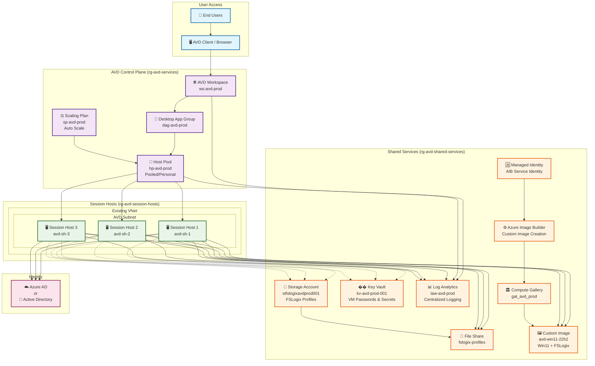

# Azure Virtual Desktop (AVD) Terraform Deployment 🚀

> **Deploy a complete Azure Virtual Desktop environment with Azure Image Builder support - fully automated with Terraform following AVD Accelerator best practices.**

## 🏗️ Architecture Overview

This Terraform configuration deploys a comprehensive, production-ready AVD environment with the following architecture:



### 🔧 **Key Components Deployed**

| Component | Resource Name | Purpose |
|-----------|---------------|---------|
| **🏢 Host Pool** | `hp-avd-prod` | Central AVD resource managing session hosts |
| **🖥️ Session Hosts** | `avd-sh-1,2,3` | Windows 11 VMs with AVD agents |
| **�� Key Vault** | `kv-avd-prod-001` | Secure storage for VM passwords |
| **💾 Storage Account** | `stfslogixavdprod001` | FSLogix profile storage with RBAC |
| **📊 Log Analytics** | `law-avd-prod` | Centralized monitoring and diagnostics |
| **🏛️ Compute Gallery** | `gal_avd_prod` | Custom image storage and versioning |
| **⚙️ Image Builder** | AIB Template | Automated custom image creation |
| **⚖️ Scaling Plan** | `sp-avd-prod` | Intelligent auto-scaling during business hours |

## ✨ Key Features

- **🔧 Azure Image Builder Integration**: Automated custom image creation with Windows 11 + FSLogix
- **🌐 Existing Network Support**: Works seamlessly with your hub-spoke architecture
- **🔒 Security First**: Key Vault integration, RBAC, network restrictions, and managed identities
- **📈 Auto Scaling**: Built-in scaling plans for intelligent cost optimization
- **🔍 Full Observability**: Log Analytics with comprehensive diagnostic settings
- **⚡ Domain Flexibility**: Supports both Azure AD and Active Directory Domain Services
- **📋 AVD Accelerator Aligned**: Follows Microsoft's recommended best practices

## 🚀 Quick Start

### Prerequisites

1. **Azure CLI** and **Terraform** installed
2. **Owner permissions** on target Azure subscription
3. **Existing virtual network** (or modify to create new one)

### Deployment Steps

```bash
# 1. Clone and navigate
git clone https://github.com/travishankins/terraform-avd-deployment.git
cd terraform-avd-deployment

# 2. Login to Azure
az login
az account set --subscription "<your-subscription-id>"

# 3. Customize configuration
cp terraform.tfvars terraform.tfvars.local
# Edit terraform.tfvars.local with your specific values

# 4. Deploy infrastructure
terraform init
terraform plan -var-file="terraform.tfvars.local"
terraform apply -var-file="terraform.tfvars.local"

# 5. Build custom image (if enabled)
# The image template will be created, trigger build via:
# az image builder run --name <template-name> --resource-group <rg-name>
```

## ⚙️ Configuration

### Essential Variables

| Variable | Description | Default |
|----------|-------------|---------|
| `location` | Azure region | `"East US"` |
| `prefix` | Resource name prefix | `"avd"` |
| `use_existing_network` | Use existing VNet | `true` |
| `enable_image_builder` | Create AIB resources | `false` |
| `session_host_count` | Number of session hosts | `2` |
| `domain_join_type` | `"AzureAD"` or `"ActiveDirectory"` | `"AzureAD"` |

### Networking Configuration

```hcl
# For existing network
use_existing_network    = true
existing_vnet_name      = "vnet-hub-prod"
existing_vnet_rg_name   = "rg-network-prod" 
existing_subnet_name    = "snet-avd-session-hosts"
```

### Azure Image Builder

```hcl
# Enable custom image creation
enable_image_builder = true
aib_build_timeout   = 120
aib_vm_size         = "Standard_D2s_v3"

# Custom image configuration
use_custom_image = true
```

## 📁 File Structure

```
.
├── main.tf                    # Main infrastructure resources
├── variables.tf               # Variable definitions
├── outputs.tf                # Resource outputs
├── versions.tf               # Provider version constraints
├── terraform.tfvars          # Default variable values
├── .gitignore                # Git ignore rules
└── README.md                  # This file
```

## 🔧 Advanced Configuration

### Scaling Plans

The scaling plan is configured with intelligent business hours scaling:

- **Ramp Up (8:00 AM)**: Prepare hosts for the day
- **Peak Hours (9:00 AM - 6:00 PM)**: Maximum availability
- **Ramp Down (6:00 PM)**: Graceful user logout with 30-min warning
- **Off Peak (8:00 PM)**: Minimal hosts for cost optimization

### Active Directory Domain Join

```hcl
domain_join_type     = "ActiveDirectory"
domain_name          = "contoso.com"
domain_ou_path       = "OU=AVD,DC=contoso,DC=com"
domain_join_username = "avdjoin"
domain_join_password = "SecurePassword123!"
```

## 🔍 Monitoring and Troubleshooting

### Key Resources to Monitor

- **Host Pool**: Connection and session metrics
- **Session Hosts**: CPU, memory, disk usage
- **Storage Account**: FSLogix profile performance
- **Image Builder**: Build success/failure logs

### Common Issues

1. **Image Build Failures**: Check AIB logs in Log Analytics
2. **Domain Join Issues**: Verify credentials and OU path
3. **Storage Access**: Ensure RBAC assignments completed
4. **Network Connectivity**: Verify subnet and NSG rules

## 📊 Outputs

After deployment, key information is available via outputs:

```bash
# Get workspace information
terraform output workspace_name
terraform output workspace_id

# Get storage details
terraform output file_share_url
terraform output storage_account_name

# Get registration token (sensitive)
terraform output -raw host_pool_registration_token
```

## 🔐 Security Considerations

- **VM passwords** stored in Key Vault
- **Registration tokens** automatically rotate every 29 days
- **Storage access** restricted via network rules and RBAC
- **Image Builder** uses managed identity with least privilege
- **Diagnostic logs** sent to Log Analytics for monitoring

## 🧹 Cleanup

```bash
# Remove all resources
terraform destroy -var-file="terraform.tfvars.local"
```

## 🤝 Contributing

1. Fork the repository
2. Create a feature branch
3. Make your changes
4. Submit a pull request

## �� License

This project is licensed under the MIT License - see the LICENSE file for details.

## 📞 Support

- Create an [issue](https://github.com/travishankins/terraform-avd-deployment/issues) for bug reports
- Check [Azure AVD documentation](https://docs.microsoft.com/azure/virtual-desktop/)
- Review [AVD Accelerator](https://github.com/Azure/avdaccelerator) for additional patterns

---

**Built with ❤️ following Azure Virtual Desktop best practices**
