# Azure Virtual Desktop (AVD) Terraform Deployment 🚀

> **Deploy a complete Azure Virtual Desktop environment with Azure Image Builder support - fully automated with Terraform following AVD Accelerator best practices.**

## 🏗️ Architecture Overview

This Terraform configuration deploys a comprehensive, production-ready AVD environment with the following architecture:

```mermaid
graph TB
    %% User Access Layer
    subgraph "User Access"
        USER[👤 End Users]
        CLIENT[🖥️ AVD Client / Browser]
    end
    
    %% Azure Virtual Desktop Control Plane
    subgraph "AVD Control Plane (rg-avd-services)"
        WS[🌐 AVD Workspace<br/>ws-avd-prod]
        HP[🏢 Host Pool<br/>hp-avd-prod<br/>Pooled/Personal]
        DAG[📱 Desktop App Group<br/>dag-avd-prod]
        SP[⚖️ Scaling Plan<br/>sp-avd-prod<br/>Auto Scale]
    end
    
    %% Session Hosts
    subgraph "Session Hosts (rg-avd-session-hosts)"
        subgraph "Existing VNet"
            subgraph "AVD Subnet"
                SH1[🖥️ Session Host 1<br/>avd-sh-1]
                SH2[🖥️ Session Host 2<br/>avd-sh-2] 
                SH3[🖥️ Session Host 3<br/>avd-sh-3]
            end
        end
    end
    
    %% Shared Services
    subgraph "Shared Services (rg-avd-shared-services)"
        %% Storage
        SA[💾 Storage Account<br/>stfslogixavdprod001<br/>FSLogix Profiles]
        FS[📁 File Share<br/>fslogix-profiles]
        
        %% Key Vault
        KV[�� Key Vault<br/>kv-avd-prod-001<br/>VM Passwords & Secrets]
        
        %% Monitoring
        LAW[📊 Log Analytics<br/>law-avd-prod<br/>Centralized Logging]
        
        %% Image Builder
        GAL[🏛️ Compute Gallery<br/>gal_avd_prod]
        IMG[🖼️ Custom Image<br/>avd-win11-22h2<br/>Win11 + FSLogix]
        AIB[⚙️ Azure Image Builder<br/>Custom Image Creation]
        MSI[🆔 Managed Identity<br/>AIB Service Identity]
    end
    
    %% Azure AD / Active Directory
    subgraph "Identity"
        AAD[☁️ Azure AD<br/>or<br/>🏢 Active Directory]
    end
    
    %% Connections - User Flow
    USER --> CLIENT
    CLIENT --> WS
    WS --> DAG
    DAG --> HP
    HP --> SH1
    HP --> SH2
    HP --> SH3
    
    %% Session Host Dependencies
    SH1 --> FS
    SH2 --> FS
    SH3 --> FS
    SA --> FS
    
    SH1 --> AAD
    SH2 --> AAD
    SH3 --> AAD
    
    SH1 --> IMG
    SH2 --> IMG
    SH3 --> IMG
    
    %% Scaling
    SP --> HP
    
    %% Image Builder Flow
    AIB --> GAL
    GAL --> IMG
    MSI --> AIB
    
    %% Monitoring & Security
    HP --> LAW
    WS --> LAW
    SH1 --> LAW
    SH2 --> LAW
    SH3 --> LAW
    
    SH1 -.-> KV
    SH2 -.-> KV
    SH3 -.-> KV
    
    %% RBAC for Storage
    SH1 -.-> SA
    SH2 -.-> SA
    SH3 -.-> SA
    
    %% Styling
    classDef userAccess fill:#e1f5fe,stroke:#01579b,stroke-width:2px
    classDef avdControl fill:#f3e5f5,stroke:#4a148c,stroke-width:2px
    classDef sessionHost fill:#e8f5e8,stroke:#1b5e20,stroke-width:2px
    classDef sharedServices fill:#fff3e0,stroke:#e65100,stroke-width:2px
    classDef identity fill:#fce4ec,stroke:#880e4f,stroke-width:2px
    
    class USER,CLIENT userAccess
    class WS,HP,DAG,SP avdControl
    class SH1,SH2,SH3 sessionHost
    class SA,FS,KV,LAW,GAL,IMG,AIB,MSI sharedServices
    class AAD identity
```



### 🔧 **Key Components Deployed**

| Component | Resource Name | Purpose |
|-----------|---------------|---------|
| **🏢 Host Pool** | `hp-avd-prod` | Central AVD resource managing session hosts |
| **🖥️ Session Hosts** | `avd-sh-1,2,3` | Windows 11 VMs with AVD agents |
| **�� Key Vault** | `kv-avd-prod-001` | Secure storage for VM passwords |
| **💾 Storage Account** | `stfslogixavdprod001` | FSLogix profile storage with RBAC |
| **📊 Log Analytics** | `law-avd-prod` | Centralized monitoring and diagnostics |
| **🏛️ Compute Gallery** | `gal_avd_prod` | Custom image storage and versioning |
| **⚙️ Image Builder** | AIB Template | Automated custom image creation |
| **⚖️ Scaling Plan** | `sp-avd-prod` | Intelligent auto-scaling during business hours |

## ✨ Key Features

- **🔧 Azure Image Builder Integration**: Automated custom image creation with Windows 11 + FSLogix
- **🌐 Existing Network Support**: Works seamlessly with your hub-spoke architecture
- **🔒 Security First**: Key Vault integration, RBAC, network restrictions, and managed identities
- **�️ Private Endpoints**: Optional private endpoint deployment for maximum security isolation
- **�📈 Auto Scaling**: Built-in scaling plans for intelligent cost optimization
- **🔍 Full Observability**: Log Analytics with comprehensive diagnostic settings
- **⚡ Domain Flexibility**: Supports both Azure AD and Active Directory Domain Services
- **📋 AVD Accelerator Aligned**: Follows Microsoft's recommended best practices

## 🚀 Quick Start

### Prerequisites

1. **Azure CLI** and **Terraform** installed
2. **Owner permissions** on target Azure subscription
3. **Existing virtual network** (or modify to create new one)

### Deployment Steps

```bash
# 1. Clone and navigate
git clone https://github.com/travishankins/terraform-avd-deployment.git
cd terraform-avd-deployment

# 2. Login to Azure
az login
az account set --subscription "<your-subscription-id>"

# 3. Customize configuration (choose one option):

# Option A: Standard deployment with network restrictions
cp terraform.tfvars terraform.tfvars.local
# Edit terraform.tfvars.local with your specific values

# Option B: High-security deployment with private endpoints
cp terraform.tfvars.private-endpoints terraform.tfvars.local
# Edit terraform.tfvars.local with your specific values

# 4. Deploy infrastructure
terraform init
terraform plan -var-file="terraform.tfvars.local"
terraform apply -var-file="terraform.tfvars.local"

# 5. Build custom image (if enabled)
# The image template will be created, trigger build via:
# az image builder run --name <template-name> --resource-group <rg-name>
```

## ⚙️ Configuration

### Essential Variables

| Variable | Description | Default |
|----------|-------------|---------|
| `location` | Azure region | `"East US"` |
| `prefix` | Resource name prefix | `"avd"` |
| `use_existing_network` | Use existing VNet | `true` |
| `enable_private_endpoints` | Deploy services behind private endpoints | `false` |
| `enable_image_builder` | Create AIB resources | `false` |
| `session_host_count` | Number of session hosts | `2` |
| `domain_join_type` | `"AzureAD"` or `"ActiveDirectory"` | `"AzureAD"` |

### Networking Configuration

```hcl
# For existing network
use_existing_network    = true
existing_vnet_name      = "vnet-hub-prod"
existing_vnet_rg_name   = "rg-network-prod" 
existing_subnet_name    = "snet-avd-session-hosts"
```

### Azure Image Builder

```hcl
# Enable custom image creation
enable_image_builder = true
aib_build_timeout   = 120
aib_vm_size         = "Standard_D2s_v3"

# Custom image configuration
use_custom_image = true
```

### Private Endpoints (Enhanced Security)

For maximum security, enable private endpoints to isolate all Azure services from public internet access:

```hcl
# Enable private endpoints for all supported services
enable_private_endpoints     = true
private_endpoint_subnet_name = "snet-private-endpoints"
create_private_dns_zones     = true  # Automatically create private DNS zones

# Services secured with private endpoints:
# - Storage Account (Blob & File endpoints)  
# - Key Vault
# - Compute Gallery
# - Log Analytics (future enhancement)
```

**Prerequisites for Private Endpoints:**
- Dedicated subnet for private endpoints (`snet-private-endpoints`)
- Network security group rules allowing private endpoint traffic
- DNS resolution configured (automatically handled if `create_private_dns_zones = true`)

**Example network setup:**
```hcl
# Your VNet should have these subnets:
# - snet-avd-session-hosts     (for session host VMs)
# - snet-private-endpoints     (for private endpoints)
```

## 📁 File Structure

```
.
├── main.tf                           # Main infrastructure resources
├── variables.tf                      # Variable definitions
├── outputs.tf                        # Resource outputs
├── versions.tf                       # Provider version constraints
├── terraform.tfvars                  # Default variable values
├── terraform.tfvars.private-endpoints # Example config with private endpoints
├── .gitignore                        # Git ignore rules
└── README.md                         # This file
```

### 🔒 **Security Configurations**

The repository includes example configurations for different security postures:

- **`terraform.tfvars`**: Standard deployment with network restrictions
- **`terraform.tfvars.private-endpoints`**: Enhanced security with private endpoints

**Recommended approach:**
1. Copy one of the example files to `terraform.tfvars.local`
2. Customize `terraform.tfvars.local` with your specific values
3. Use `terraform.tfvars.local` for deployment (this file is automatically ignored by git)

**Quick deployment options:**
```bash
# Standard security deployment
terraform apply -var-file="terraform.tfvars"

# High-security deployment with private endpoints  
terraform apply -var-file="terraform.tfvars.private-endpoints"

# Custom deployment (after copying and editing)
terraform apply -var-file="terraform.tfvars.local"
```

## 🔧 Advanced Configuration

### Scaling Plans

The scaling plan is configured with intelligent business hours scaling:

- **Ramp Up (8:00 AM)**: Prepare hosts for the day
- **Peak Hours (9:00 AM - 6:00 PM)**: Maximum availability
- **Ramp Down (6:00 PM)**: Graceful user logout with 30-min warning
- **Off Peak (8:00 PM)**: Minimal hosts for cost optimization

### Active Directory Domain Join

```hcl
domain_join_type     = "ActiveDirectory"
domain_name          = "contoso.com"
domain_ou_path       = "OU=AVD,DC=contoso,DC=com"
domain_join_username = "avdjoin"
domain_join_password = "SecurePassword123!"
```

## 🔍 Monitoring and Troubleshooting

### Key Resources to Monitor

- **Host Pool**: Connection and session metrics
- **Session Hosts**: CPU, memory, disk usage
- **Storage Account**: FSLogix profile performance
- **Image Builder**: Build success/failure logs

### Common Issues

1. **Image Build Failures**: Check AIB logs in Log Analytics
2. **Domain Join Issues**: Verify credentials and OU path
3. **Storage Access**: Ensure RBAC assignments completed
4. **Network Connectivity**: Verify subnet and NSG rules

## 📊 Outputs

After deployment, key information is available via outputs:

```bash
# Get workspace information
terraform output workspace_name
terraform output workspace_id

# Get storage details
terraform output file_share_url
terraform output storage_account_name

# Get registration token (sensitive)
terraform output -raw host_pool_registration_token
```

## 🔐 Security Considerations

- **VM passwords** stored in Key Vault
- **Registration tokens** automatically rotate every 29 days
- **Storage access** restricted via network rules and RBAC
- **Image Builder** uses managed identity with least privilege
- **Diagnostic logs** sent to Log Analytics for monitoring

### 🛡️ **Private Endpoints Security Benefits**

When `enable_private_endpoints = true`, the following security enhancements are applied:

**Network Isolation:**
- All Azure services are accessible only through private IP addresses
- Public internet access is completely disabled for protected services
- Traffic flows entirely within your virtual network

**Services Protected:**
- **Storage Account**: Both Blob and File endpoints secured
- **Key Vault**: All secret access through private network only
- **Compute Gallery**: Custom image access via private endpoints
- **Private DNS**: Automatic DNS resolution for private endpoints

**Zero Trust Architecture:**
- No data leaves your virtual network perimeter
- Eliminates attack surface from public internet
- Compliance with strict security requirements (PCI DSS, HIPAA, etc.)

## 🧹 Cleanup

```bash
# Remove all resources (using your customized configuration)
terraform destroy -var-file="terraform.tfvars.local"

# Alternative: Use specific configuration files directly
# terraform destroy -var-file="terraform.tfvars"
# terraform destroy -var-file="terraform.tfvars.private-endpoints"
```

## 🤝 Contributing

1. Fork the repository
2. Create a feature branch
3. Make your changes
4. Submit a pull request

## �� License

This project is licensed under the MIT License - see the LICENSE file for details.

## 📞 Support

- Create an [issue](https://github.com/travishankins/terraform-avd-deployment/issues) for bug reports
- Check [Azure AVD documentation](https://docs.microsoft.com/azure/virtual-desktop/)
- Review [AVD Accelerator](https://github.com/Azure/avdaccelerator) for additional patterns

---

**Built with ❤️ following Azure Virtual Desktop best practices**
